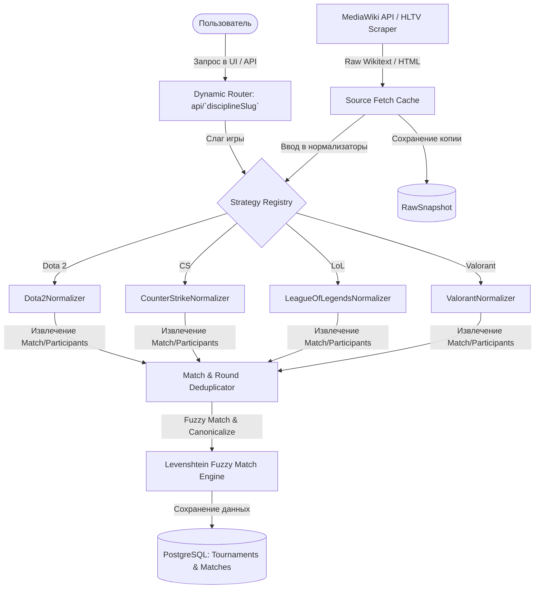
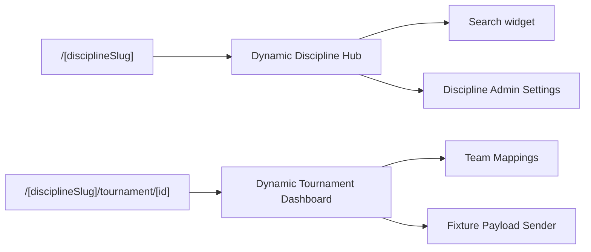

# 🚀 TCYBER: Advanced Esport Data Engine

Добро пожаловать в **TCYBER** — высокопроизводительный, отказоустойчивый и архитектурно совершенный движок для ручного импорта, нормализации и маппинга киберспортивных турниров (CS, Dota2, LoL, Valorant) из Liquipedia и HLTV.

Проект разработан по высочайшим стандартам программной инженерии: с **100% динамическим роутингом**, **централизованным реестром стратегий-нормализаторов**, **интеллектуальным fuzzy-маппингом команд на базе расстояния Левенштейна** и **встроенной системой телеметрии**.

---

## 📐 Архитектурная Схема Системы

### 1. Конвейер Инжеста и Нормализации Данных (Data Ingestion Pipeline)



### 2. Схема Динамического Маршрутизатора Страниц (Next.js App Router)



---

## 📂 Структура каталогов (Clean Architecture)

Кодовая база строго разграничена по доменным зонам, исключая "спагетти-импорты" и связывая логику через чистые абстракции.

```text
liquipedia/
├── prisma/                    # Схема БД (PostgreSQL) и сид-файлы
├── scripts/                   # Утилиты автоматизации и CLI
│   └── tcyber-cli.ts          # Единый пульт разработчика TCYBER CLI
├── tests/                     # 100% покрывающий юнит-тест-сьют (52 теста)
├── src/
│   ├── app/                   # Физические роуты приложения (Next.js 15 App Router)
│   │   ├── [disciplineSlug]/  # Динамический хаб дисциплин (Универсальный UI)
│   │   │   └── tournament/[id] # Детализированный дашборд турнира и маппинга
│   │   ├── api/               # Унифицированное REST API
│   │   │   ├── [disciplineSlug]/ # Динамический импорт, поиск и превью
│   │   │   ├── admin/         # Телеметрия и мониторинг
│   │   │   └── disciplines/   # Глобальные настройки родительских категорий
│   │   └── settings/          # Глобальные настройки системы и прокси-пула
│   ├── components/            # Изолированные React-компоненты
│   │   ├── admin/             # Управление заливкой и импортом команд
│   │   ├── hltv/              # Парсинг ручного текста HLTV
│   │   ├── layout/            # Шапка, навигация, каркас
│   │   ├── settings/          # Дашборды телеметрии и настройки кэша
│   │   ├── tournament/        # Маппинг команд, превью и отправка payload
│   │   └── ui/                # Базовые атомарные дизайн-компоненты (дизайн-система)
│   └── lib/                   # Чистая бизнес-логика (Domain & Application Services)
│       ├── adminUpload/       # Сериализация PHP Array и отправка mTLS
│       ├── config/            # Глобальные константы и параметры дисциплин
│       ├── db/                # Клиент Prisma
│       ├── hltv/              # Парсинг HLTV
│       ├── liquipedia/        # Клиент MediaWiki API, Rate-Limiter
│       ├── matches/           # Дедупликация матчей, валидация качества данных
│       ├── normalizers/       # Нормализаторы Wikitext (Реестр нормализаторов)
│       ├── sync/              # Инструменты синхронизации Identity Sync
│       ├── teams/             # Нечёткий поиск (Fuzzy Match) и канонизация команд
│       └── utils/             # Математические и строковые хелперы
```

---

## 🛠 Единый CLI-пульт Разработчика

Для упрощения отладки в терминале создан единый пульт `tcyber-cli.ts`. Запустите его командой:

```bash
npx tsx scripts/tcyber-cli.ts
```

### Доступные операции:
* `db:check` — Быстрый замер задержки PostgreSQL и вывод статистики таблиц.
* `cache:clear` — Освобождение дискового пространства (удаление кэша wikitext и временных логов).
* `proxy:check` — Сводная статистика здоровья прокси-пула, выявление забаненных адресов.
* `deploy` — Запуск тестов готовности серверов и резервного копирования.

---

## 📊 Интеллектуальный OCR Fuzzy Match Engine

Модуль `src/lib/teams/fuzzyMatch.ts` использует алгоритм вычисления **Расстояния Левенштейна** совместно с substring-весовыми коэффициентами. 

Это позволяет движку находить идеальные совпадения в базе данных даже при сильном уровне шума во входящих строках (например, после оптического распознавания скриншотов трансляций операторами):

```typescript
// Пример работы нечёткого поиска
const match = await findClosestPlatformTeam("counterstrike", "G2 Esportz!");
// Результат -> { platformId: "123", platformName: "G2 Esports", score: 0.91 }
```

API эндпоинт для пакетной обработки:
`POST /api/team-mapping/fuzzy`

---

## 🖥️ Панель диагностики и телеметрии (Health Dashboard)

В разделе **Настройки Системы** интегрирован интерактивный виджет диагностики, опрашивающий эндпоинт `/api/admin/health`:
* **БД Пинг**: Визуальный индикатор задержки соединения (зелёный <100ms, жёлтый <250ms, красный для аномалий).
* **Качество Прокси**: Процент активных и заблокированных адресов в пуле с визуальным прогресс-баром.
* **Parser Activity Log**: Интерактивная таблица последних 8 запросов парсинга с выводом статуса кэша (`CACHED` / `LIVE FETCH`) и классов возникших ошибок.

---

## 🚦 Показатели Качества и Тесты

В системе развёрнут строгий юнит-тест-сьют, проверяющий крайние случаи парсинга скобок, дублирующихся раундов, TBD-слотов и proxy-коалдаунов.

```bash
npm run typecheck   # 0 ошибок компиляции (TypeScript 5.x)
npm test            # 52/52 тестов успешно пройдены (зелёная зона)
```

Вывод тестов:
```text
✔ Dota2 normalizer preserves empty TBD playoff slots (10.13ms)
✔ Valorant normalizer only keeps stage subpages from the selected event (1.72ms)
✔ dedupeTournamentMatches collapses the same dated pair even when sides are swapped (4.40ms)
✔ team canonicalizer prefers the full participant name for short Liquipedia labels (0.96ms)
✔ team mapping lookup prefers saved platform IDs over stale unmapped duplicates (0.47ms)
ℹ tests 52 | pass 52 | duration_ms 602.22
```

---

## 🔒 Безопасность и Деплой

* **mTLS (Mutual TLS)**: Поддержка аутентификации через клиентские PEM/PFX сертификаты (папка `certs/` надёжно защищена в `.gitignore`).
* **Identity Sync**: Механизм фонового резервного копирования и синхронизации локального PostgreSQL сервера с продакшеном.
* **Production Build Ready**: Приложение полностью готово к сборке через `npm run build` с автоматическим запуском миграций БД при запуске Docker-контейнера.
