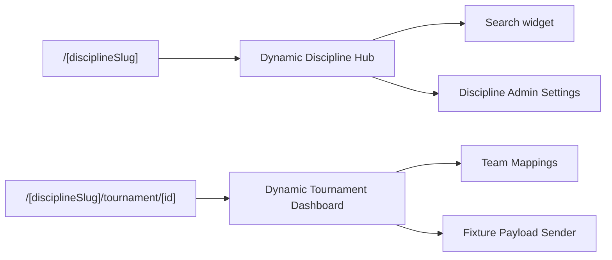

# 🚀 TData: Advanced Tournament Data Engine

Добро пожаловать в **TData** — высокопроизводительный, отказоустойчивый и архитектурно совершенный движок для ручного импорта, нормализации и маппинга турниров из Liquipedia, HLTV, VLR, DLTV, Fandom и volleyball-источников.

Проект разработан по высочайшим стандартам программной инженерии: с **100% динамическим роутингом**, **централизованным реестром стратегий-нормализаторов**, **интеллектуальным fuzzy-маппингом команд на базе расстояния Левенштейна** и **встроенной системой телеметрии**.

---

## 📐 Архитектурная Схема Системы

### 1. Конвейер Инжеста и Нормализации Данных (Data Ingestion Pipeline)


### 2. Схема Динамического Маршрутизатора Страниц (Next.js App Router)



---

## 📂 Структура каталогов (Clean Architecture)

Кодовая база строго разграничена по доменным зонам, исключая "спагетти-импорты" и связывая логику через чистые абстракции.

```text
TData/
├── frontend/                  # Next.js приложение: UI, App Router и тонкие API adapters
│   ├── public/                # Статические ассеты приложения
│   ├── src/
│   │   ├── app/               # Pages, layouts и route handlers Next.js
│   │   │   ├── [disciplineSlug]/
│   │   │   ├── api/           # HTTP-слой: валидация запроса и вызов backend services
│   │   │   └── settings/
│   │   └── components/        # React UI-компоненты без прямого доступа к Prisma/filesystem
│   ├── next.config.mjs
│   ├── postcss.config.js
│   └── tailwind.config.ts
├── backend/                   # Серверная доменная логика и интеграции
│   ├── prisma/                # Схема БД (PostgreSQL), миграции и seed
│   └── src/
│       ├── adminUpload/       # FIxt payload, upload policy и Admin API client
│       ├── adminTeams/        # Импорт и подсказки команд админки
│       ├── auth/              # Admin session/password guard
│       ├── db/                # Prisma client
│       ├── imports/           # Оркестрация импорта турниров
│       ├── matches/           # Дедупликация, расписание, качество матчей
│       ├── normalizers/       # Нормализаторы Wikitext/HTML
│       ├── sources/           # Liquipedia, HLTV, VLR, DLTV, Fandom, TBvolley, WTT
│       ├── sync/              # Identity sync
│       └── teams/             # Canonicalize, fuzzy match, automapping
├── scripts/                   # Утилиты автоматизации и CLI
│   └── tdata-cli.ts          # Единый пульт разработчика TData CLI
├── tests/                     # Unit/integration/e2e проверки
├── docker-compose.yml         # Canonical compose deployment
├── Dockerfile                 # Production image build
└── package.json               # Root orchestration scripts
```

---

## 🛠 Единый CLI-пульт Разработчика

Для упрощения отладки в терминале создан единый пульт `tdata-cli.ts`. Запустите его командой:

```bash
npx tsx scripts/tdata-cli.ts
```

## GitHub Save Agent

Для сохранения, коммита и пуша проекта в GitHub используйте локального агента:

```powershell
npm run git:save -- -Message "Describe the saved change"
```

Агент держит `origin` на `https://github.com/inftverezovsky/TData.git`, коммитит от `inftverezovsky <inf.tverezovsky@gmail.com>` и пушит в `main`. Пароли и токены не сохраняются в проекте.

### Доступные операции:
* `db:check` — Быстрый замер задержки PostgreSQL и вывод статистики таблиц.
* `cache:clear` — Освобождение дискового пространства (удаление кэша wikitext и временных логов).
* `proxy:check` — Сводная статистика здоровья прокси-пула, выявление забаненных адресов.
* `deploy` — Запуск тестов готовности серверов и резервного копирования.

---

## 📊 Интеллектуальный OCR Fuzzy Match Engine

Модуль `backend/src/teams/fuzzyMatch.ts` использует алгоритм вычисления **Расстояния Левенштейна** совместно с substring-весовыми коэффициентами.

Это позволяет движку находить идеальные совпадения в базе данных даже при сильном уровне шума во входящих строках (например, после оптического распознавания скриншотов трансляций операторами):

```typescript
// Пример работы нечёткого поиска
const match = await findClosestPlatformTeam("counterstrike", "G2 Esportz!");
// Результат -> { platformId: "123", platformName: "G2 Esports", score: 0.91 }
```

API эндпоинт для пакетной обработки:
`POST /api/team-mapping/fuzzy`

---

## 🖥️ Панель диагностики и телеметрии (Health Dashboard)

В разделе **Настройки Системы** интегрирован интерактивный виджет диагностики, опрашивающий эндпоинт `/api/admin/health`:
* **БД Пинг**: Визуальный индикатор задержки соединения (зелёный <100ms, жёлтый <250ms, красный для аномалий).
* **Качество Прокси**: Процент активных и заблокированных адресов в пуле с визуальным прогресс-баром.
* **Parser Activity Log**: Интерактивная таблица последних 8 запросов парсинга с выводом статуса кэша (`CACHED` / `LIVE FETCH`) и классов возникших ошибок.

---

## 🚦 Показатели Качества и Тесты

В системе развёрнут строгий юнит-тест-сьют, проверяющий крайние случаи парсинга скобок, дублирующихся раундов, TBD-слотов и proxy-коалдаунов.

```bash
npm run typecheck   # 0 ошибок компиляции (TypeScript 5.x)
npm test            # полный unit/integration suite должен проходить без падений
```

Вывод тестов:
```text
✔ Dota2 normalizer preserves empty TBD playoff slots (10.13ms)
✔ Valorant normalizer only keeps stage subpages from the selected event (1.72ms)
✔ dedupeTournamentMatches collapses the same dated pair even when sides are swapped (4.40ms)
✔ team canonicalizer prefers the full participant name for short Liquipedia labels (0.96ms)
✔ team mapping lookup prefers saved platform IDs over stale unmapped duplicates (0.47ms)
ℹ tests 387 | pass 387
```

---

## 🔒 Безопасность и Деплой

* **mTLS (Mutual TLS)**: Поддержка аутентификации через клиентские PEM/PFX сертификаты (папка `certs/` надёжно защищена в `.gitignore`).
* **Identity Sync**: Механизм фонового резервного копирования и синхронизации локального PostgreSQL сервера с продакшеном.
* **Production Build Ready**: Приложение полностью готово к сборке через `npm run build` с автоматическим запуском миграций БД при запуске Docker-контейнера.
