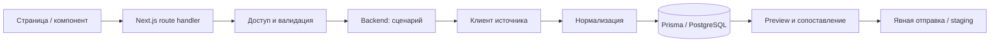

# Архитектура TData

TData — операторская система импорта спортивных данных. Один npm-проект
содержит Next.js-приложение, серверные доменные модули и фоновые CLI-задачи.
`frontend/` и `backend/` разделяют ответственность кода; это не два отдельных
HTTP-сервера и не npm workspaces. Зависимости и команды находятся в корне.

## Как проходит запрос

Внешний источник возвращает данные, нормализатор приводит их к модели TData,
доменный сервис проверяет инварианты и сохраняет результат. Компонент получает
готовую модель отображения. Импорт, предварительный просмотр и отправка —
отдельные операции: успешный импорт сам по себе не означает отправку в Admin.

## Карта каталогов

| Путь | Ответственность | Что сюда не помещать |
|---|---|---|
| `frontend/src/app` | Страницы, layouts, границы ошибок и HTTP-адаптеры App Router | Большие парсеры и интеграционные клиенты |
| `frontend/src/components` | Интерфейс и интерактивные сценарии по предметным областям | Доступ к БД, секретам и серверной файловой системе |
| `frontend/src/services` | Общие обращения браузера к HTTP API | Прямые внешние вызовы с секретами |
| `backend/src` | Бизнес-правила, интеграции, хранение и политики | React UI |
| `backend/prisma` | Схема, миграции и seed | Копии рабочих БД |
| `scripts` | Явно запускаемые CLI и инструменты сопровождения | Автоматические действия при открытии страницы |
| `tests/*.test.ts` | Тесты без PostgreSQL, HTTP-адаптеры с подменёнными зависимостями | Зависимость от сегодняшней даты или живого сайта |
| `tests/integration` | Проверки настоящей БД, транзакций и ограничений | Подключения к рабочей базе |
| `tests/e2e` | Сценарии desktop/mobile и FIxt с локальным mock API | Реальные внешние отправки |
| `tests/fixtures` | Воспроизводимые образцы входных данных | Реальные учётные данные |
| `docs`, `deploy` | Архитектура, инструкции и эксплуатационные шаблоны | Секретные значения окружения |

`.codex-logs/`, `.codex-deploy-*/`, `cache/`, `.next/`, `test-results/` и
`.tesseract-cache/` — временные локальные материалы, исключённые из Git.
Временные deployment-снимки и вложенный клон `TData/` исключены из Docker context.
`data/tessdata/` содержит необходимые OCR-модели и остаётся частью runtime.

## Доменные модули backend

| Модуль | Назначение |
|---|---|
| `sources` | Клиенты, парсеры и адаптеры Cyber, TBvolley, TableT и КХЛ |
| `imports` | Выбор источника и запуск импорта турнира |
| `normalizers`, `matches` | Общая модель матчей, даты, расписания, dedupe |
| `teams`, `adminTeams` | Канонизация имён, сопоставление и импорт справочника Admin |
| `manualImport` | Текст, изображения, AI/OCR, очереди и ручной FIxt |
| `adminUpload` | Формирование, проверка и отправка FIxt |
| `results/khl` | Ревизии, bindings, preview, diff и staging результатов |
| `tline` | Расписания проверок, jobs, leases, сравнения и решения оператора |
| `auth`, `http`, `proxy` | Сессии, origin, адреса, прокси и ограничения запросов |
| `db`, `settings`, `cache`, `sync`, `config` | Инфраструктурные зависимости |

Точки входа: [backend/README.md](../backend/README.md),
[frontend/README.md](../frontend/README.md), [путеводитель по коду](CODE_GUIDE.md).

## Границы зависимостей

- `@/*` указывает на `frontend/src/*`; `@backend/*` — на `backend/src/*`.
- Server Components и API routes могут вызывать backend. Директива `"use client"`
  включает обычные импорты в клиентский граф: допустимы чистые безопасные helpers
  и `import type`, но не Prisma, auth или server env.
- HTTP-адаптер проверяет запрос, вызывает сценарий и переводит результат в HTTP.
  Транзакциями и порядком обработки управляет backend-сервис.
- Источник не отправляет FIxt. Он предоставляет нормализованные данные;
  `adminUpload` отдельно решает, допустима ли отправка.
- Чистые правила не зависят от БД. Мутации хранилища выполняются явно;
  замена набора матчей и участников должна быть атомарной. Force сбрасывает
  кэш загрузки, сохраняя ту же проверку качества перед записью.

## Как развивать структуру

Сохранять группировку по предметной области. Выделять типы, чистые преобразования,
сетевые операции и самостоятельные UI-блоки, когда у них отдельная причина меняться.
Не создавать пустые `controllers/`, `models/` или второй `package.json` ради дерева
папок: серверные адаптеры уже определены соглашениями Next.js.

У крупного сценария сначала покрыть поведение тестом, затем выделить одну
ответственность. Не переносить все парсеры одновременно и не менять публичные URL
ради переименования каталогов. Технический долг и результаты проверок перечислены
в [отчёте аудита](AUDIT_2026-09-07.md).

## Защита внешних действий

Маршруты отправки сначала проверяют сессию и Origin, затем разбирают ограниченное
тело запроса. Ошибки используют единый безопасный formatter; технические значения
из исключений не возвращаются клиенту. Пароль из runtime имеет приоритет;
локальная настройка хранится как salted scrypt hash. Legacy-значение в БД
обновляется при успешном входе с compare-and-swap, включая вход через env-пароль.
Лимит попыток хранится в PostgreSQL и действует между worker/process restart.

Сетевой слой проверяет допустимый host и полученные IP, закрепляет проверенный
адрес в соединении, сохраняя Host/SNI и проверку TLS. Перенаправления отправки
запрещены. Таймаут и ограничение размера действуют до конца чтения ответа.
Проверка прокси использует transport с настоящим proxy agent.
