# Автоматическая выкладка TData

Каждый push в `main` запускает GitHub Actions. На сервер попадает только актуальный
коммит после успешных проверок. Если за время проверки появился более новый push,
устаревший запуск пропускает выкладку; новый запуск доставляет последнюю версию.

```mermaid
flowchart LR
    Push[Push в main] --> Tests[Типы, тесты, БД и браузер]
    Tests --> Image[Проверка Docker-сборки]
    Image --> SSH[Ограниченный SSH-доступ]
    SSH --> Build[Сборка точного SHA на сервере]
    Build --> Backup[Проверка резервной копии БД]
    Backup --> Schema[Разрешённые миграции]
    Schema --> Update[Обновление приложения]
    Update --> Health[Health и версия коммита]
    Health -->|Сбой| Rollback[Предыдущие образы приложения]
```



## Что обновляется

Канонический проект — `/root/tdata`, Docker Compose — `tdata`, публичный адрес —
<https://www.tdata.info/>. Внутренний health endpoint:
`http://127.0.0.1:3010/api/health`.

Выкладка обновляет только `web`, `khl-worker`, `tline-worker` и
`telegram-consultant`. PostgreSQL, его тома, сертификаты, nginx и соседние приложения
не пересоздаются. Используется существующая цепочка серверных Compose-файлов.

Исходники точного SHA скачиваются из публичного GitHub в отдельный служебный
каталог. Старый рабочий каталог сервера с локальными файлами не перезаписывается.
Образ получает метку коммита, а health endpoint возвращает его в
`build.sourceRevision`. После переключения проверяются и локальный endpoint,
и публичный HTTPS-адрес.

## Доступ и служебные файлы

| Место | Назначение |
| --- | --- |
| GitHub Environment `production` | Доступен только для ветки `main` |
| `TDATA_DEPLOY_SSH_KEY` | Отдельный приватный ключ в GitHub Secrets |
| `TDATA_DEPLOY_KNOWN_HOSTS` | Проверенные публичные host keys сервера |
| `/usr/local/bin/tdata-autodeploy` | Принудительная команда для deploy-ключа |
| `/usr/local/lib/tdata-autodeploy/` | Проверенный серверный код выкладки, владелец root |
| `/etc/tdata-autodeploy.json` | Несекретный профиль с Compose-файлами и сервисами |
| `/root/tdata/.deploy/auto/` | Блокировка, сборки, образы для отката, резервные копии и результаты |

Приватный ключ создаётся в памяти установщика и передаётся непосредственно в
GitHub Secrets. На runner он загружается через stdin в `ssh-agent`. Файлы с
приватным ключом не создаются. Сервер разрешает этому ключу только команду
`deploy <SHA>`; интерактивный shell и перенаправление портов отключены.

Секреты настраиваются в
[Settings → Environments → production](https://github.com/inftverezovsky/TData/settings/environments).
Не вставляйте их в README, workflow, `.env.example` или сообщения.
Настоящие настройки приложения остаются в существующем серверном
`/root/tdata/.env` и окружении контейнеров; автоматизация их не изменяет.
Если историческому Compose-профилю не хватает обязательной переменной, обработчик
читает её из окружения действующих контейнеров TData только в память процесса.
Различающиеся значения останавливают выкладку. Эти значения доступны только
командам Compose и не передаются сборке, в журналы или файлы.

## Миграции и восстановление

Перед миграциями проверяются история и контрольные суммы SQL. Новый SQL должен
присутствовать в [migration-policy.json](../scripts/deploy/migration-policy.json)
с точным SHA256 и быть совместимым с предыдущей версией приложения. Изменение
этого списка требует отдельной проверки схемы; не добавляйте хеш ради обхода ошибки.

Перед выполнением DDL создаётся `pg_dump` и проверяется чтение всего архива.
Миграции выполняются один раз новым образом до пересоздания сервисов. Docker CMD
самостоятельно схему больше не меняет. Неудачная миграция оставляет старые
контейнеры работающими и останавливает выкладку.

При неудачном запуске приложения восстанавливаются предыдущие образы каждого
сервиса, затем повторяется health check. **Автоматического отката БД нет**:
резервная копия сохраняется для отдельного, контролируемого восстановления.
Это и есть причина ограничивать автоматические миграции совместимыми изменениями.

Сборки сериализованы. Перед работой проверяется свободное место; старые
служебные сборки ограничиваются политикой хранения. Глобальные команды
`docker system prune` и удаление чужих ресурсов не используются.

## Обслуживание

Статус конкретного push виден в
[Actions](https://github.com/inftverezovsky/TData/actions): `quality / verify` →
`build` → `Deploy TData`. Повторный запуск workflow для актуального `main`
повторяет проверки и попытку выкладки.

Профиль и обработчик устанавливаются отдельно от обновления приложения.
Для проверки серверного профиля оператор с обычным SSH-доступом может выполнить:

```bash
/usr/local/bin/tdata-autodeploy --inspect
```

Установщик [configure_autodeploy.py](../scripts/deploy/configure_autodeploy.py)
по умолчанию показывает план. Он требует Python с `cryptography`, GitHub CLI
с доступом к репозиторию, существующий SSH-ключ оператора, несекретный профиль
и уже проверенные публичные host keys. `--apply` устанавливает обработчик и
ограниченный ключ, настраивает environment и заменяет только предыдущие
deploy-ключи с собственным маркером. Остальные SSH-ключи сохраняются.

При изменении устройства серверного проекта сначала обновите и проверьте профиль,
затем переустановите обработчик. Не заменяйте серверную цепочку Compose обычным
`docker compose up` из случайного каталога: это может выбрать прежние образы.
